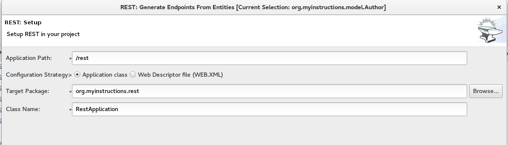

:icons: font
:sectanchors:
:toc: macro
:toclevels: 2
:toc-title: Table of Content
:numbered:
:source-highlighter: highlight.js
= JavaOne - Hands On Lab

toc::[]

== Starting Eclipse

`/home/eclipse/jee-neon/eclipse`

It should propose your the correct workspace :

`/home/osboxes/workspace`

== Starting the Forge Wizard

Press `Ctrl + 4` :

TIP: You can also use at any time the Forge Console.

== Creating the BookService

image::images/forge2.png[]

[NOTE]
For each command you will also see the console equivalent, choose whatever you want (UI or console)
[source, bash]
----
project-new --named bookservice --stack JAVA_EE_7
----

Look at the structure of the created project, you will see it's a classic Maven Java project

CAUTION: From now, in the screenshots don't take into account the package name since it's different from yours. Stick to `org.bookservice.`

=== Creating the model

Let's start to define our domain objects : our bookService will have an `author` and a `book`.

==== Creating the Author entity

In the Forge UI, type `jpa: new entity`

Since it's our first JPA entity, we need to setup our persistence layer :

You can keep all the default :

image::images/jpa1.png[]
We go for `hibernate`

image::images/jpa2.png[]

For this workshop, we will be suing the `h2` database.

Then finally we can create our `author` entity

image::images/jpa3.png[]

[source, bash]
----
jpa-new-entity --named Author
----

Look at the class that has been generated. Let's add a field now :

`jpa: new field`

image::images/jpa4.png[]

[source, bash]
----
jpa-new-field --named name
----

==== Creating the Book entity

Like for the previous step, create a `Book` entity and add the following fields :
* `title`
* `isbn`

The third field is a bit more complex since it will be a `Many-to-One` relationship with `author`

image::images/manytoone.png[]

[source, bash]
----
jpa-new-field --named author --type org.bookservice.model.Author --relationship-type Many-to-One
----

Observe the entities and the different annotations.

==== Creating the SellingPoint entity

You are now an expert to create JPA entities, so I just give you the console commands :

[source, bash]
----
jpa-new-entity --named SellingPoint
jpa-new-field --named name
jpa-new-field --named latitude --type Double
jpa-new-field --named longitude --type Double
----

=== Creating the REST endpoints

Now that we have defined our model, let's expose the CRUD (Create Read Update Delete) APIs and expose it as REST Webservice.

`rest: generate ...`

Like for the persistence layer, since it's the first time, you need to setup the REST layer, you can keep the defaults :

Then, select your entities :

image::images/rest2.png[]

[source, bash]
----
rest-generate-endpoints-from-entities --targets org.bookservice.model.*
----

Look at the generated endpoints.

=== Deploy our Bookservice

We have now enough stuff to do a first deployment !
A Wildfly 10 Server has already been configured for you.

==== Add bootstrap data

Let's add a small `sql` script that will create some entries when we start our app.
Inside the `src/main/resources/` create a file named `import.sql` and add this :
[source, sql]
----
insert into Author  (id, name, version) values (1000,'Seb',0);
insert into Author  (id, name, version) values (1001,'George',0);

insert into Book  (id, title, isbn, author_id, version) values (1000,'Forge for Pro', '1001', 1000, 0);
insert into Book  (id, title, isbn, author_id, version) values (1001,'Swarm for Pro', '1002', 1001, 0);
----

==== Deploy with Eclipse

* Right click on the project and choose `run as\run on Server`

Just follow the instructions, and you can just hit "next" for each step.

==== Deploy manually

* Open a terminal
* go to your project : `cd workspace/bookservice`
* Build the project : `mvn clean package`
* Open a second terminal
* Go to Wildfly server bin folder: `cd /home/wildfly-10.0.0.Final`
* Start the server : `./standalone.sh`
* Copy WAR file to the deployment folder : `cp /home/workspace/bookservice/target/bookservice.war /home/wildfly-10.0.0.Final/standalone/deployments`

The `bookservice` should now be deployed, browse to `http://localhost:8080/bookservice/rest/authors` it should returns an array with 2 authors.

=== Scaffolding the Frontend

Let's create a CRUD Web client, with Forge it's really easy :
* Start the Forge UI and search for `scaffold: generate`.
* Choose for `AngularJS` for the Scaffold Type.
* Select all the entities

You're done ! Build the app and deploy it again, now browse to `http://localhost:8080/bookservice`

image:images/webapp.png[]

Play a bit around, try all the CRUD operations. Look also at the generated frontend scripts that are using AngularJS.

== Decomposing our App into Microservices

Now, let's decompose this application into 3 different microservices :

* The book Service
* The SellingPoint Service
* The Frontend

Let's start with turning our app into a Swarm Microsevice

=== Bookservice Swarm application

To turn our app into a Swarm app it's really easy, from the Forge UI search for `Wildfly-Swarm: Setup` , keep the default and click `finish`

Now, let's detect the fractions and them to our `pom.xml` , Look up for the `Wildfly-Swarm: Detect Fractions` command and be sure to check `Add Missing Fractions as Project Dependencies` :

image::images/swarm2.png[]

Inspect your `pom.xml` to see the changes.

[source, bash]
----
wildfly-swarm-setup
wildfly-swarm-detect-fractions --depend --build
----

==== Enable CORS

Our microservice will be consumed from other domains, therefore we need to enable CORS, that's also easy with Forge, search for `REST: New Cross Origin Resource Sharing Filer` :

image::images/cors.png[]

[source, bash]
----
rest-new-cross-origin-resource-sharing-filter
----

==== Run Swarm app
You have two options from a terminal :

* `mvn clean wildfly-swarm:run`
* Or first build the app with `mvn clean package` and after that run the JAR `java -jar target/bookservice-swarm.jar`

Ok, now backend is running now as a microservice, let's extract the Frontend into a standalone microservice as well.

=== Frontend Swarm application

Create a new project with Forge called `bookstore` and for Project type choose "Wildfly Swarm Microservice", for the stack choose "JavaEE 7".

CAUTION: For the project location, be sure to be in the workspace root : `/home/osboxes/workspace`

image::images/frontendwizard.png[]

Then you have the `Swarm` setup wizard, set the port to `8081` and on the next page select the fraction `undertow`.

TIP: Undertow is a flexible performant web server written in java, providing both blocking and non-blocking API’s based on NIO.

[source, bash]
----
project-new --named bookstorefrontend --stack JAVA_EE_7 --type wildfly-swarm --http-port 8081
wildfly-swarm-add-fraction --fractions undertow
----

Now we need to copy, the content of the `src/main/webapp` folder from our first project `bookservice` into the `src/main/webapp` of the `bookstore` project.
You can do this using the Eclipse explorer or by running this forge command :

[source, bash]
----
mv ../bookservice/src/main/webapp/ src/main/
----

==== Update the frontend AngularJS Rest services

Our Frontend must now call a remote REST service, open first :

`src/main/webapp/scripts/services/AuthorFactory.js`

find we specify the URL and replace it with `http://localhost:8080/rest/authors/:AuthorId`.

Do the same for `BookFactory.js`, we will change `SellingPointFactory.js` later.

==== Deploy the app

* `mvn clean wildfly-swarm:run`
* Or first build the app with `mvn clean package` and after that run the JAR `java -jar target/bookstore-swarm.jar`

You can browse to `http://locahost:8081` to make sure everything is running.

=== SellingPoint Swarm App

Let's rewrite the SellingPoint service from scratch and let's add some cool features like `hibernate-search` and `geospatial queries`.
Now that you know how Forge works I just give you the script, run each line or use the UI, it's up to you.

CAUTION: Forge can not add import statements, so be sure to do that manually ;)

[source, bash]
----
project-new --named sellingPoint --stack JAVA_EE_7 --type wildfly-swarm --http-port 8082
wildfly-swarm-add-fraction --fractions hibernate-search
# create Book entity and relationship with Author
jpa-new-entity --named Book
jpa-new-field --named isbn
java-add-annotation --annotation org.hibernate.search.annotations.Field --on-property isbn

# create Book entity and relationship with Author
jpa-new-entity --named SellingPoint
jpa-new-field --named name
java-add-annotation --annotation org.hibernate.search.annotations.Indexed
java-add-annotation --annotation org.hibernate.search.annotations.Spatial
jpa-new-field --named latitude --type Double
jpa-new-field --named longitude --type Double
java-add-annotation --annotation org.hibernate.search.annotations.Longitude --on-property longitude
java-add-annotation --annotation org.hibernate.search.annotations.Latitude --on-property latitude
jpa-new-field --named books --type org.sellingPoint.model.Book --relationship-type Many-to-Many --fetch-type EAGER
java-add-annotation --annotation org.hibernate.search.annotations.IndexedEmbedded --on-property books

scaffold-generate --provider AngularJS --generate-rest-resources --targets org.sellingPoint.model.*
wildfly-swarm-detect-fractions --depend --build
# enable CORS
rest-new-cross-origin-resource-sharing-filter
----

==== Add our geolocation search endpoint

In `src/main/java/org/sellingPoint/rest/SellingPointEndpoint.java` , create a new method :

[source, java]
----
@GET
@Path("/inrange/{isbn}")
@Produces("application/json")
public List<SellingPoint> listByLocation(@PathParam("isbn") String isbn, @QueryParam("latitude") Double latitude,
    @QueryParam("longitude") Double longitude) {
  FullTextEntityManager fullTextEntityManager = Search.getFullTextEntityManager(em);
  QueryBuilder builder = fullTextEntityManager.getSearchFactory().buildQueryBuilder()
      .forEntity(SellingPoint.class).get();

  org.apache.lucene.search.Query luceneQuery = builder

      .spatial().within(5, Unit.KM).ofLatitude(latitude).andLongitude(longitude).createQuery();
  org.apache.lucene.search.Query keyWordQuery = builder

      .keyword().onField("books.isbn").matching(isbn).createQuery();
  Query boolQuery = builder.bool().must(luceneQuery).must(keyWordQuery).createQuery();
  javax.persistence.Query hibQuery = fullTextEntityManager.createFullTextQuery(boolQuery, SellingPoint.class);
  return hibQuery.getResultList();
}
----

Don't forget the imports !

==== Add initial bootstrap data

Let's add a small `sql` script that will create some entries when we start our app.
Inside the `src/main/resources/` create a file named `import.sql` and add this :
[source, sql]
----
insert into Book (id, isbn, version) values (1000, '1000',0);
insert into Book (id, isbn, version) values (1001, '1001',0);
insert into Book (id, isbn, version) values (1002, '1002',0);

insert into SellingPoint (id, latitude, longitude, name, version) values (2000, 43.5780, 7.0545, 'bob', 0);
insert into SellingPoint (id, latitude, longitude, name, version) values (2001, 43.574357, 7.1142449, 'chris',0);

insert into SellingPoint_Book (SellingPoint_id, books_id) values (2000,1000);
insert into SellingPoint_Book (SellingPoint_id, books_id) values (2000,1001);
----

==== Initial boostrap data

[source,sql]
----
insert into Book (id, isbn, version) values (1000, '1000',0);
insert into Book (id, isbn, version) values (1001, '1001',0);
insert into Book (id, isbn, version) values (1002, '1002',0);

insert into SellingPoint (id, latitude, longitude, name, version) values (2000, 43.5780, 7.0545, 'bob', 0);
insert into SellingPoint (id, latitude, longitude, name, version) values (2001, 43.574357, 7.1142449, 'chris',0);

insert into SellingPoint_Book (SellingPoint_id, books_id) values (2000,1000);
insert into SellingPoint_Book (SellingPoint_id, books_id) values (2000,1001);
----

TIP: Please change the long and lat depending on where you are.

==== Deploy the app

* `mvn clean wildfly-swarm:run`
* Or first build the app with `mvn clean package` and after that run the JAR `java -jar target/sellingpoint-swarm.jar`

==== Updating the Frontend app to consume the SellingPoint Service
In the `bookstore` app go to `src/main/webapp/scripts/services/SellingPoints.js` and replace the content with :

[source, javascript]
-----
angular.module('bookservice').factory('SellingPointResource', function($resource){
    var resource = $resource('http://localhost:8082/rest/sellingpoints/inrange/:Isbn',{Isbn:'@isbn'},{'queryAll':{method:'GET',isArray:true},'query':{method:'GET',isArray:false},'update':{method:'PUT'}});
    return resource;
});
-----

In `src/main.webapp/scripts/controllers/searchSellingPointController.js` reaplce with :

[source, javascript]
----

angular.module('bookservice').controller('SearchSellingPointController', function($scope, $window, $http, $filter, SellingPointResource ) {

	navigator.geolocation.getCurrentPosition(function(position){
		$scope.latitude = position.coords.latitude;
		$scope.longitude = position.coords.longitude;
		$scope.$apply();

	}, function(error){});

    $scope.search={};
    $scope.currentPage = 0;
    $scope.pageSize= 10;
    $scope.searchResults = [];
    $scope.filteredResults = [];
    $scope.pageRange = [];
    $scope.numberOfPages = function() {
        var result = Math.ceil($scope.filteredResults.length/$scope.pageSize);
        var max = (result == 0) ? 1 : result;
        $scope.pageRange = [];
        for(var ctr=0;ctr<max;ctr++) {
            $scope.pageRange.push(ctr);
        }
        return max;
    };

    $scope.performSearch = function() {
        $scope.searchResults = SellingPointResource.queryAll({Isbn:$scope.isbn, longitude:$scope.longitude,latitude:$scope.latitude},function(){
            $scope.filteredResults = $filter('searchFilter')($scope.searchResults, $scope);
            $scope.currentPage = 0;
        });
    };

    $scope.previous = function() {
       if($scope.currentPage > 0) {
           $scope.currentPage--;
       }
    };

    $scope.next = function() {
       if($scope.currentPage < ($scope.numberOfPages() - 1) ) {
           $scope.currentPage++;
       }
    };

    $scope.setPage = function(n) {
       $scope.currentPage = n;
    };

    //$scope.performSearch();
});
----

And finally, in the view `src/main/webapp/views/SellingPoint/search.html` :

[source, html]
-----

    <h3>Search books around you</h3>
    <form id="SellingPointSearch" class="form-horizontal">

    

        <label for="name" class="col-sm-2 control-label">ISBN</label>
        

            <input id="name" name="name" class="form-control" type="text" ng-model="isbn" placeholder="Enter the SellingPoint Name"></input>
        

    

    

        <label for="latitude" class="col-sm-2 control-label">Latitude</label>
        

            <input id="latitude" name="latitude" class="form-control" type="text" ng-model="latitude" placeholder="Enter the SellingPoint Latitude"></input>
        

    

    

        <label for="longitude" class="col-sm-2 control-label">Longitude</label>
        

            <input id="longitude" name="longitude" class="form-control" type="text" ng-model="longitude" placeholder="Enter the SellingPoint Longitude"></input>
        

    

        

            

                <a id="Search" name="Search" class="btn btn-primary" ng-click="performSearch()"> Search</a>
            

        

    </form>

        

        <table class="table table-responsive table-bordered table-striped clearfix">
            <thead>
                <tr>
                    <th>Name</th>
                    <th>Latitude</th>
                    <th>Longitude</th>
                </tr>
            </thead>
            <tbody id="search-results-body">
                <tr ng-repeat="result in filteredResults | startFrom:currentPage*pageSize | limitTo:pageSize">
                    <td><a href="#/SellingPoints/edit/{{result.id}}">{{result.name}}</a></td>
                    <td><a href="#/SellingPoints/edit/{{result.id}}">{{result.latitude}}</a></td>
                    <td><a href="#/SellingPoints/edit/{{result.id}}">{{result.longitude}}</a></td>
                </tr>
            </tbody>
        </table>
    

        <ul class="pagination pagination-centered">
        <li ng-class="{disabled:currentPage == 0}">
            <a id="prev" href ng-click="previous()">«</a>
        </li>
        <li ng-repeat="n in pageRange" ng-class="{active:currentPage == n}" ng-click="setPage(n)">
            <a href ng-bind="n + 1">1</a>
        </li>
        <li ng-class="{disabled: currentPage == (numberOfPages() - 1)}">
            <a id="next" href ng-click="next()">»</a>
        </li>
    </ul>

-----

Rebuild your app and deploy it, you should now be able to perform Spacial Queries

== Secure All the Things !!
=== Keycloak Introduction

=== Create Keycloak Server Microservice

Create a new project called `keycloak-server` , choose for :
* stack JAVA_EE_7
* type wildfly-swarm
* Set http port to `8083`
* Add Fraction `keycloak-server`

[source, bash]
----
project-new --named keycloak-server --stack JAVA_EE_7 --type wildfly-swarm --http-port 8083
wildfly-swarm-add-fraction --fractions keycloak-server
----

This is all you have to do to run a KeyCloak Server

==== Deploy the app

* `mvn clean wildfly-swarm:run`
* Or first build the app with `mvn clean package` and after that run the JAR `java -jar target/keycloak-server-swarm.jar`

==== Set the admin user

* Browse to `http://localhost:8083/auth` and set the admin user credentials

==== Create a new Realm

* Browse to the master realm and login

image::images/keycloak2.png[]

* Create a new realm `javaonehol`

==== Configure Keycloak Server

===== Create a `role` user

===== Create new user

===== Reset credentials

==== Set Role Mapping

==== Create bookservice client

On the next screen set the client to `bearer Only` :

===== Download keycloak.json

* In the installation tab , select `Keycloak OIDC JSON` format and download the file.

* Copy it to `bookstore/src/main/webapp/WEB-INF`

==== Create bookfrontend client

===== Download keycloak.json

* In the installation tab , select `Keycloak OIDC JSON` format and download the file.

* Copy it to `bookservice/src/main/webapp`

CAUTION: Be sure to set the redirect URL

==== Create sellingpoint client

Same instructions as for the 'bookservice client'

=== Secure BookService App

Go back to Eclipse and open your Forge UI :

* Add a new swarm fraction : `keycloak`
* Search for "Security Add login config" :
** Realm : `javaonehol`
** Authentification Method : `KEYCLOAK`

Add security constraints :
* Search for "Security Add constraint"

[source, bash]
-----
security-add-constraint --web-resource-name Book --url-patterns /rest/* --security-roles user
-----

The `web.xml` should look like that :

[source, xml]
-----
<login-config>
<auth-method>KEYCLOAK</auth-method>
  <realm-name>javaonehol</realm-name>
</login-config>
<security-role>
<role-name>user</role-name>
</security-role>
<security-constraint>
<web-resource-collection>
  <web-resource-name>Book</web-resource-name>
    <url-pattern>/rest/*</url-pattern>
  </web-resource-collection>
  <auth-constraint>
  <role-name>user</role-name>
  </auth-constraint>
</security-constraint>
</web-app>
-----

* Remove the CORS filter : `rm src/main/java/org/bookservice/rest/NewCrossOriginResourceSharingFilter.java`

* Open `src/main/webapp/WEB-INF/keycloak.json` and add this key :

`enable-cors: true`

Redeploy the application and try to access any endpoints ...

=== Secure BookStore Frontend App

* In the `src/main/webapp/app.html`, at the section where all the JS scripts are loaded, add this one as first :
``

* In the `<html>` tag remove the `ng-app` attribute.

* In  `sr/main/webapp/scripts/app.js` append :

[source, javascript]
----
var keycloak = new Keycloak('keycloak.json');

angular.element(document).ready(function() {
  keycloak.init({ onLoad: 'login-required' }).success(function () {
    angular.bootstrap(document, ["bookservice"]);
  }).error(function () {
    console.log("ERROR");
  });
});

angular.module('bookservice').factory('authInterceptor', function($q) {
  return {
    request: function (config) {
      var deferred = $q.defer();
      if (keycloak.token) {
        keycloak.updateToken(5).success(function() {
          config.headers = config.headers || {};
          config.headers.Authorization = 'Bearer ' + keycloak.token;
          deferred.resolve(config);
        }).error(function() {
          deferred.reject('Failed to refresh token');
        });
      }
      return deferred.promise;
    }
  };
});

angular.module('bookservice').config(function($httpProvider) {
  $httpProvider.defaults.useXDomain = true;
  $httpProvider.interceptors.push('authInterceptor');
});

----

Redeploy the app, you should now be redirected to a login screen.

=== Secure SellingPoint
