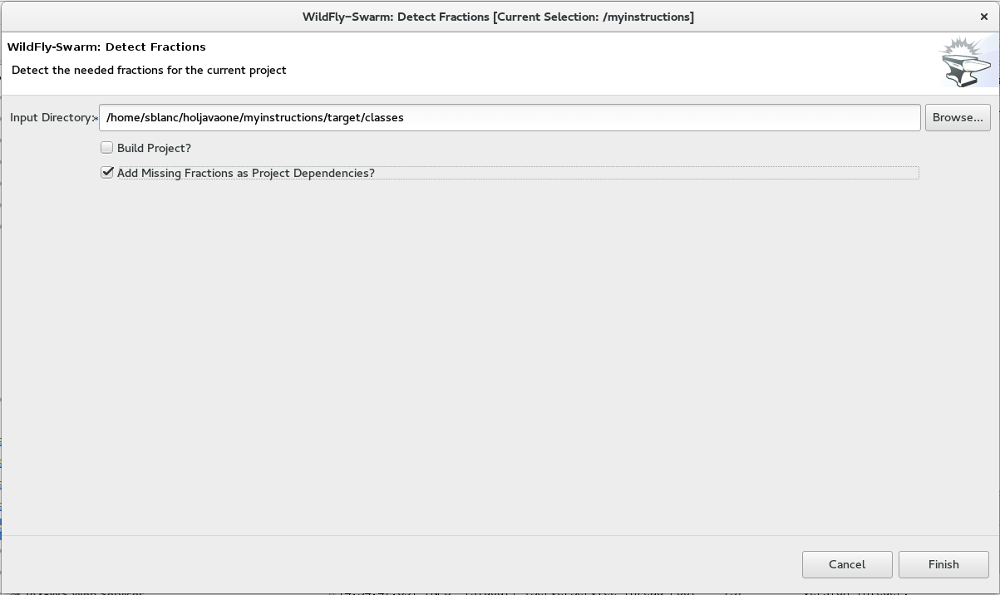

= JavaOne - Hands On Lab

toc::[]

== Starting Eclipse

`/home/eclipse/jee-neon/eclipse`

It should propose your the correct workspace :

`/home/osboxes/workspace`

== Starting the Forge Wizard

Press `Ctrl + 4` :

image::images/forge1.png[]

TIP: You can also use at any time the Forge Console.

== Creating the BookService

[NOTE]
For each command you will also see the console equivalent, choose whatever you want (UI or console)
[source, bash]
----
project-new --named bookservice --stack JAVA_EE_7
----

Look at the structure of the created project, you will see it's a classic Maven Java project

CAUTION: From now, in the screenshots don't take into account the package name since it's different from yours. Stick to `org.bookservice.`

=== Creating the model

Let's start to define our domain objects : our bookService will have an `author` and a `book`.

==== Creating the Author entity

In the Forge UI, type `jpa: new entity`

Since it's our first JPA entity, we need to setup our persistence layer :

You can keep all the default :

We go for `hibernate`

image::images/jpa2.png[]

For this workshop, we will be suing the `h2` database.

Then finally we can create our `author` entity

image::images/jpa3.png[]

[source, bash]
----
jpa-new-entity --named Author
----

Look at the class that has been generated. Let's add a field now :

`jpa: new field`

[source, bash]
----
jpa-new-field --named name
----

==== Creating the Book entity

Like for the previous step, create a `Book` entity and add the following fields :
* `title`
* `isbn`

The third field is a bit more complex since it will be a `Many-to-One` relationship with `author`

[source, bash]
----
jpa-new-field --named author --type org.bookservice.model.Author --relationship-type Many-to-One
----

Observe the entities and the different annotations.

==== Creating the SellingPoint entity

You are now an expert to create JPA entities, so I just give you the console commands :

[source, bash]
----
jpa-new-entity --named SellingPoint
jpa-new-field --named name
jpa-new-field --named latitude --type Double
jpa-new-field --named longitude --type Double
----

=== Creating the REST endpoints

Now that we have defined our model, let's expose the CRUD (Create Read Update Delete) APIs and expose it as REST Webservice.

`rest: generate ...`

Like for the persistence layer, since it's the first time, you need to setup the REST layer, you can keep the defaults :

image::images/rest.png[]

Then, select your entities :

image::images/rest2.png[]

[source, bash]
----
rest-generate-endpoints-from-entities --targets org.bookservice.model.*
----

Look at the generated endpoints.

=== Deploy our Bookservice

We have now enough stuff to do a first deployment !
A Wildfly 10 Server has already been configured for you.

==== Add bootstrap data

Let's add a small `sql` script that will create some entries when we start our app.
Inside the `src/main/resources/` create a file named `import.sql` and add this :
[source, sql]
----
insert into Author  (id, name, version) values (1000,'Seb',0);
insert into Author  (id, name, version) values (1001,'George',0);

insert into Book  (id, title, isbn, author_id, version) values (1000,'Forge for Pro', '1001', 1000, 0);
insert into Book  (id, title, isbn, author_id, version) values (1001,'Swarm for Pro', '1002', 1001, 0);
----

==== Deploy with Eclipse

* Right click on the project and choose `run as\run on Server`

Just follow the instructions, and you can just hit "next" for each step.

==== Deploy manually

* Open a terminal
* go to your project : `cd workspace/bookservice`
* Build the project : `mvn clean package`
* Open a second terminal
* Go to Wildfly server bin folder: `cd /home/wildfly-10.0.0.Final`
* Start the server : `./standalone.sh`
* Copy WAR file to the deployment folder : `cp /home/workspace/bookservice/target/bookservice.war /home/wildfly-10.0.0.Final/standalone/deployments`

The `bookservice` should now be deployed, browse to `http://localhost:8080/bookservice/rest/authors` it should returns an array with 2 authors.

=== Scaffolding the Frontend

Let's create a CRUD Web client, with Forge it's really easy :
* Start the Forge UI and search for `scaffold: generate`.
* Choose for `AngularJS` for the Scaffold Type.
* Select all the entities

You're done ! Build the app and deploy it again, now browse to `http://localhost:8080/bookservice`

Play a bit around, try all the CRUD operations. Look also at the generated frontend scripts that are using AngularJS.

== Decomposing our App into Microservices

Now, let's decompose this application into 3 different microservices :

* The book Service
* The SellingPoint Service
* The Frontend

Let's start with turning our app into a Swarm Microsevice

=== Bookservice Swarm application

To turn our app into a Swarm app it's really easy, from the Forge UI search for `Wildfly-Swarm: Setup` , keep the default and click `finish`

image::images/swarm1.png[]

Now, let's detect the fractions and them to our `pom.xml` , Look up for the `Wildfly-Swarm: Detect Fractions` command and be sure to check `Add Missing Fractions as Project Dependencies` :

Inspect your `pom.xml` to see the changes.

[source, bash]
----
wildfly-swarm-setup
wildfly-swarm-detect-fractions --depend --build
----

==== Enable CORS

Our microservice will be consumed from other domains, therefore we need to enable CORS, that's also easy with Forge, search for `REST: New Cross Origin Resource Sharing Filer` :

[source, bash]
----
rest-new-cross-origin-resource-sharing-filter
----

==== Run Swarm app
You have two options from a terminal :

* `mvn clean wildfly-swarm:run`
* Or first build the app with `mvn clean package` and after that run the JAR `java -jar target/bookservice-swarm.jar`

Ok, now backend is running now as a microservice, let's extract the Frontend into a standalone microservice as well.

=== Frontend Swarm application

Create a new project with Forge called `bookstore` and for Project type choose "Wildfly Swarm Microservice", for the stack choose "JavaEE 7".

CAUTION: For the project location, be sure to be in the workspace root : `/home/osboxes/workspace`

Then you have the `Swarm` setup wizard, set the port to `8081` and on the next page select the fraction `undertow`.

TIP: Undertow is a flexible performant web server written in java, providing both blocking and non-blocking API’s based on NIO.

[source, bash]
----
project-new --named bookstorefrontend --stack JAVA_EE_7 --type wildfly-swarm --http-port 8081
wildfly-swarm-add-fraction --fractions undertow
----

Now we need to copy, the content of the `src/main/webapp` folder from our first project `bookservice` into the `src/main/webapp` of the `bookstore` project.
You can do this using the Eclipse explorer or by running this forge command :

[source, bash]
----
mv ../bookservice/src/main/webapp/ src/main/
----

==== Update the frontend AngularJS Rest services

Our Frontend must now call a remote REST service, open first :

`src/main/webapp/scripts/services/AuthorFactory.js`

find we specify the URL and replace it with `http://localhost:8080/rest/authors/:AuthorId`.

Do the same for `BookFactory.js`, we will change `SellingPointFactory.js` later.

==== Deploy the app

* `mvn clean wildfly-swarm:run`
* Or first build the app with `mvn clean package` and after that run the JAR `java -jar target/bookstore-swarm.jar`

You can browse to `http://locahost:8081` to make sure everything is running.
